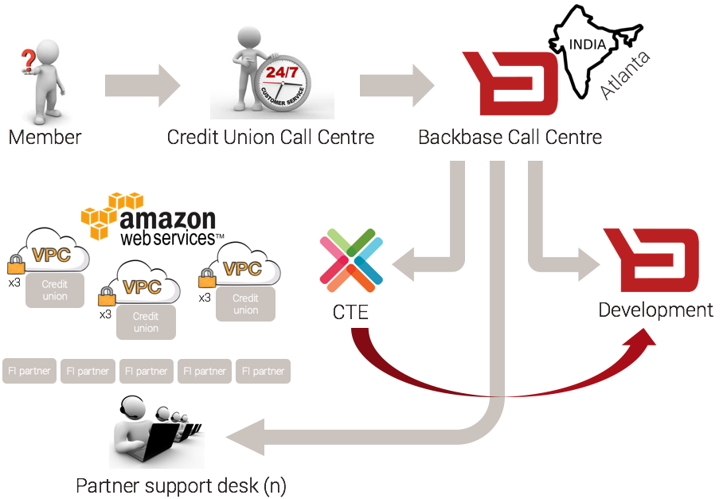
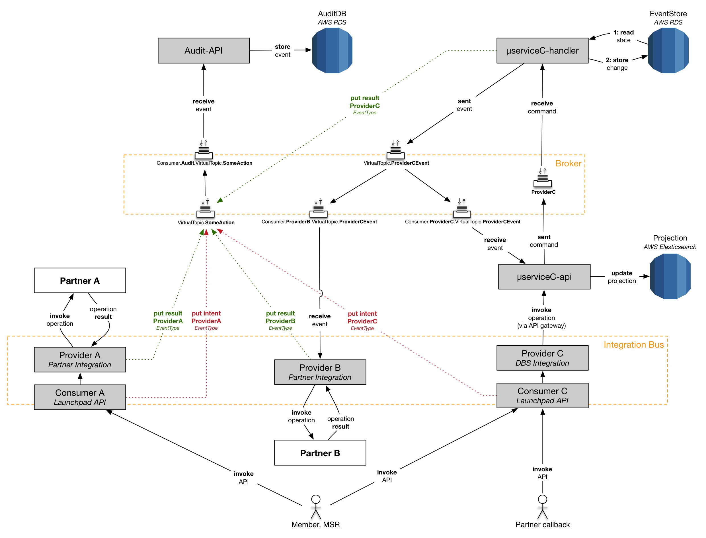
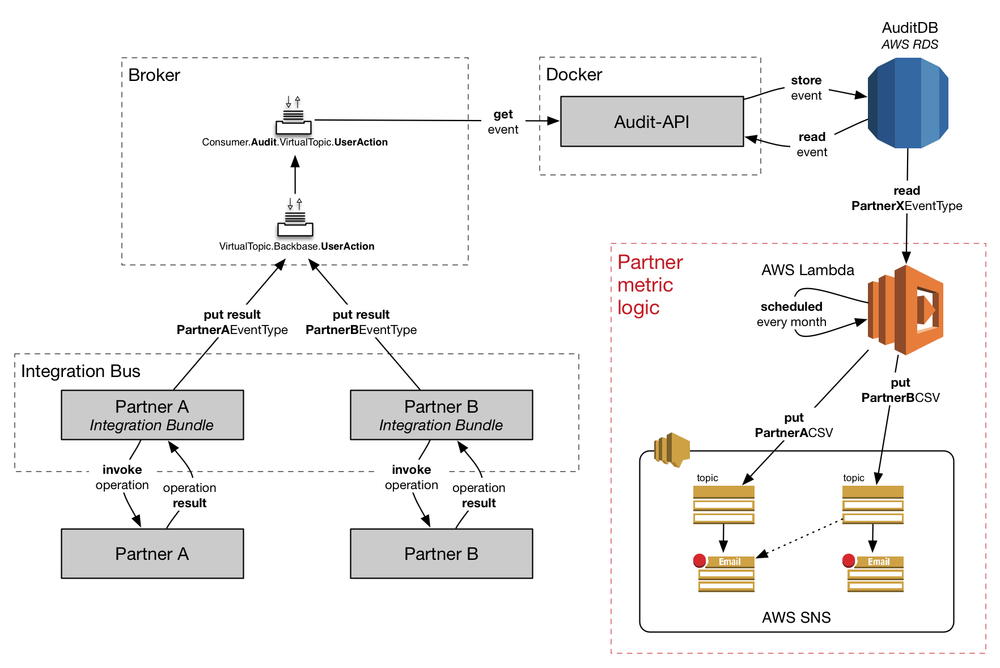

# Audit trail design
**Author**: Robin Huiser, **updated**: 8h of June 2016

This document describes the design for improving the Digital Banking Platform Audit capability. 

## Current state
Only subset of all member initiated security and user requests is captured by the Audit capability. 

==...MSRs are limited in providing - independent from Backbase -  support to members. ...metrics cannot be collected to support billing of partner usage..., increased problem resolve times==

## Requirements
==Summary overall requirements for support, billing and compliance here==.

### Support
==Explain support context here (credit union call centre, BB call center, technical support)==.

1. A
2. B
3. C
4. D

#### Member support
Through CSR portal the Member Support Representative (MSR) should be able to identify **all sessions** for a member based upon its **userid** (member login name).

For a **specific session** (identified by its (hashed) **HTTP SessionID**), follow all **member initiated actions**.

For a **specific member initiated action**, the MSR should be able to correlate **request** and **result(s)**:

* get details for the **request** as a result of the member initiated **action**
	* For a **specific request** identified by its request identifier (**RequestID)**, provide information about the intention of the user:
		* the **intention**; for example: 
			* ``Initiate bill pay``
			* ``Create address book entry``
		* the **intention-context** - recognisable properties of an **action**; for example:
			* For bill pay: ``account xxx`` + ``amount yyy`` + ``date zzz`` 
			* For creating an address book entry: ``Robin`` + ``Huiser`` + ``robinh@backbase.com``
* get details for **all results** of the requested action
	* For a **specific result**, next to **success** or **failure reason**, its details should include information about 
		* originated **RequestID** (orginatorId in DBS)
		* the responsible **provider**; for example:
			* ``Payveris``
			* ``Ensenta``
			* ``Backbase``
			* ``Corelation``
		* the **ProviderID** assigned to the member 
		* the **service** identity from the provider; for example: 
			* ``Bill Pay`` in case of Payveris
			* ``Party`` (capability) in case of Backbase
		* the **reference**; for example: 
			* ``payment ID`` for Bill Pay in case of Payveris 
			* ``address book entry ID`` in case of Backbase party capability

Once the MSR concludes the member problem cannot be solved using the functionality exposed by CSR Portal, the MSR needs to open a case with the Backbase Call Center. The case must include the information listed below to:

* Description of the problem
* Member **PartyID**
* Member (hashed) **SessionID**
* The member **intention**, including the **context** 
* The **RequestID** 
* All **results** found in the system related to the member action:
	* Status concerning **succes** or **failure reason**
	* Responsible **provider**, **service** and **reference**
	* Member **ProviderID** 

==An idea would be to automate opening a ticket with Backbase based upon the selected request identifier in CSR portal - this would assure fast and complete ticket data to be submitted==

#### Technical support
In order to perform root cause analysis efficiently it is crucial to correlate the CSR provided information in the ticket to logging entries generated by system components.

Log statements should therefore be enriched with context such as:

* (Hashed) **HTTP SessionID** - correlate all **actions** within a single member **session**
* **RequestID** - correlate all **results** of a single **action**

### Billing
The Digital Banking Platform (USA) revenue is partly based upon invoicing channel partner cost + mark-up to customers. A mechanism to measure and report partner usage (called metrics) is therefore required.

Provider	| Service  		| Unit		| Audited | Comment |
:---		| :---		 		| :---		| :---    | :---
Payveris	| Billpay | # successful transactions  | Yes | *
Payveris	| A2A | # successful transactions  | Yes | *
Payveris	| P2P | # successful transactions  | Yes | *
MX			| ALL | # of active users per month  | Yes | -
Geezeo		| ALL | # of active users per month  | Yes | -
BDI			| Creation & placement of documents / e-statements | # created and placed documents & retention period  | No | Artefacts are managed outside of DBP
Ensenta	| Deposits | # of checks | Yes | -
CA			| Authentication | # of active users, twice per 12 months | Yes | -

\* *Definition of successful is when Payveris accepts the transaction order through its API.*

### Compliance
The information stored in the Audit trail as specified under **member support** satisfies all requirements for compliancy.

==Short description how we protect HTTP Session ID, multiple layers of defense (CU Call Center, BB Call center, etc...), database protection, network protection, etc...==

####Reporting
The following reports needs...

* ==Exception report== - requirements to be delivered by Alexander.

### Business intelligence
Should be able to distinguish between action and result to generate business reports.

==Define reporting requirements here==.

## Solution
There is a need to capture and correlate both **actions** and **results**; this additional audit information needs to be submitted to the audit capability by all components responsible for:
 
* operating as entry point of the system for the outside world
* applying business logic when modifying client data such as implemented by the handler µservices
* interacting with partner / 3rd party systems such as Payveris or CA

### Design in 60 seconds
Text.

**Action** (marked red in diagram):

*  Assure all actions (intent) are audited for every entry point in the system; this includes widget, mobile & call-back APIs invoked from the outside world
*  Extend the properties of the data audited with the ``RequestID`` 

**Result(s)** (marked green in diagram):

* A
* B

### Support
**Security** and **user** actions (auditable events)...

* Are stored
* Are searchable
* Are augmented with user context
* Can be correlated between request and result
* Can be linked to 
	* a specific service provider
	* technical application logging

### Billing
Text...

#### Existing or projected architecture
The following audit event flow is either in place or projected and agreed upon to be in place before go-live. 

* The result of every partner API **invocation** is pushed as an **event** to the event bus (broker)
* These **events** are picked up by the existing **Audit capability** and stored in the **AuditDB RDBMS**

#### New or updated architecture
Components within the ==red rectangle== in the figure above are to be developed by the cloud team; functionality is:

* Via an **AWS scheduler**, a **Partner metric Lambda process** is started 
* The partner events over the last x number of days are aggregated from the **RDBMS** and pushed in **CSV format** to the **partner specific SNS topic**
* AWS SNS takes care of **routing the CSV** to its final destination which can include, but is not limited to, **eMail** or **3rd party billing systems** 
* CSV data is processed by billing system and invoices are sent out to customers

### Compliance

====